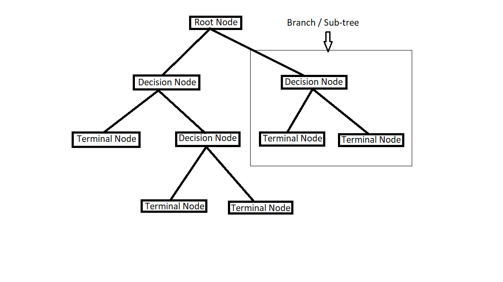
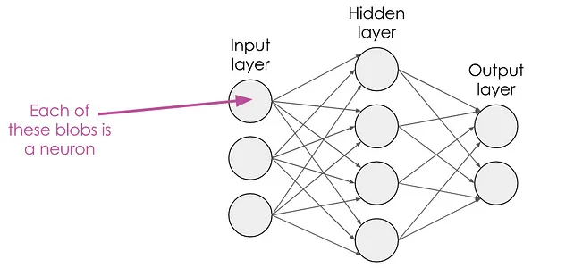
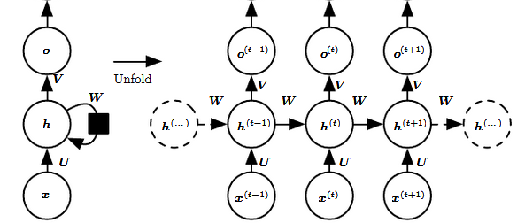
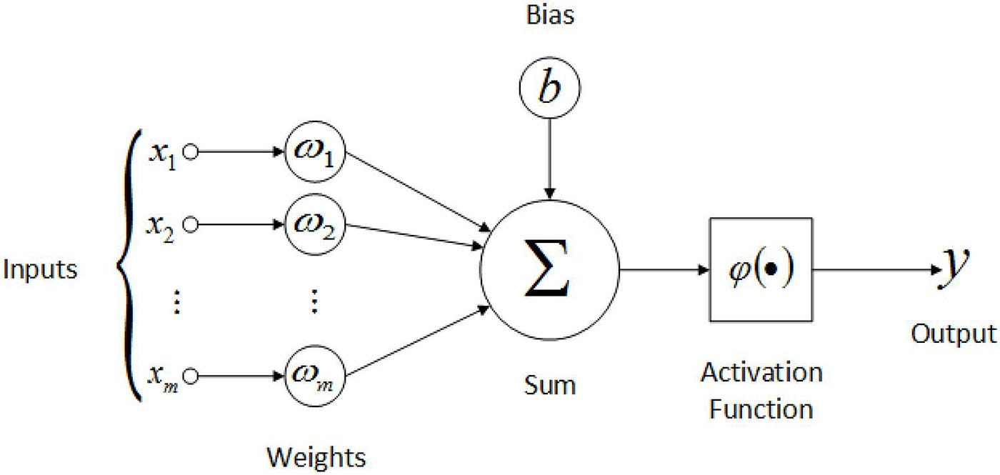
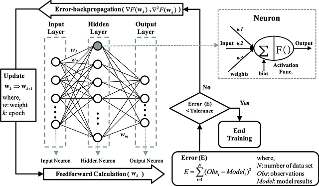
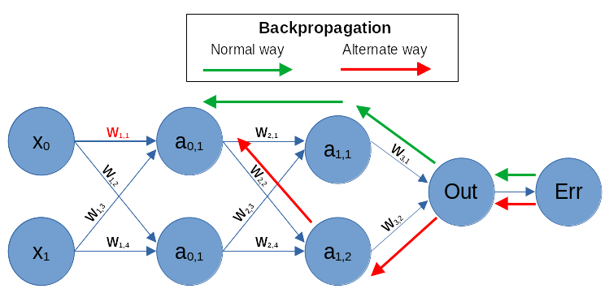
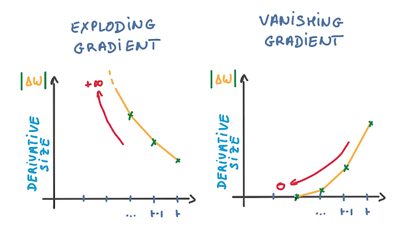
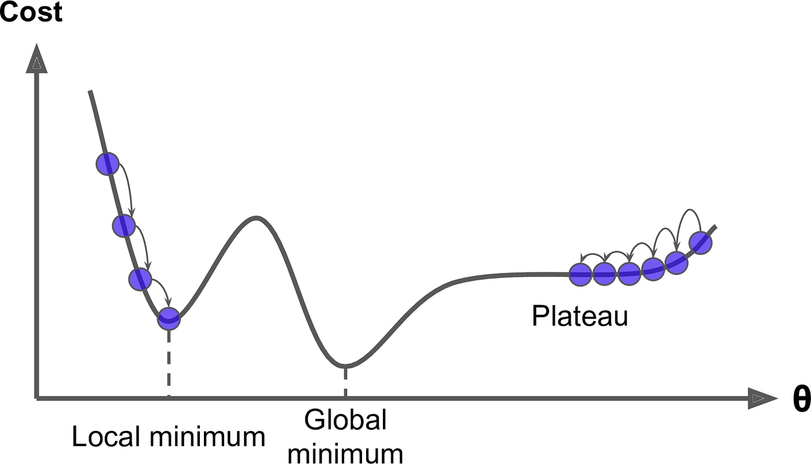

# 4. predmet ; izdelek - GLOBOKO UČENJE

# Kaj sploh je umetna inteligenca?

**Umetna inteligenca** je veja računalništva osredotočena na razvoj in raziskovanje sistemov, ki so sposobni posnemati človekovo razmišljanje.

Takšni sistemi so v praksi večkrat specializirani, torej ustvarjeni da, izvajajo samo eno dejavnost(npr. samo generacija slik, samo prepoznavanje oblik ipd.). Zaradi njihove omejenosti jih uvrščamo med ozko ali šibko umetno inteligenco.

Sistemi, ki pa so sposobni učenja, razumevanja in prilagajanja, torej učenja iz izkušenj, prilagajanja novim/različnim situacijam spadajo pod močno ali splođno umetno inteligenco. 
>Takšni sistemi so trenutno je le cilj v področju umetne inteligence

# Strojno učenje

> Machine learning is a subfield of AI, that achives the preforming of tasks requring human-like intelligence with algorithms, creating models to preform the tasks without directly programming them to do so. 

AI is all about making systems able to preform tasks that generally require human-like intelligence right ? 

So machine learning is focused on achiving that with the development of algorithms and models that enable systems to preform those tasks without being programmed with specific rules on how to preform them, but rather by learning on specific datasets and applying that to new data.

Generally, they are used when:

- the solution for the task at hand is not clear/direct/simple,

- there is repeated decision making/evalution

- we have labled data, mapped to the desired result

| |   |
|---|---|
| procedure | a process or set of rules to follow  |
| program | a series of coded software instructions  |
| algorithm  | a process or set of rules to follow in order to solve a problem |
| method | a series of actions conducted in a certain order or manner in order to solve a problem |
| |   |

>
>As with (apparently) everything withing the field of AI many terms are used interchangeably.
>
>So in general algorithm = method = program (all procedures; series of actions to do something)
>
>Model is a program - programs are algorithms - algorithms are methods, so models are also called methods.
>
>Methods withing machine learning are also just procedures, that tell the model what to do with the data. (they are algorithms - still part of a model, making them methods withing a method if you will)
>
>Let's draw a very clear line on what each thing is
>
>| |   |
>|---|---|
>| model | is the program that we give data to in order to preform the task that requires human-like intelligence.   (want to predict housing prices based on house size ? - you create a model to do it) |
>| method | procedures to process data within a model   (they process the housing size-price data ; there can be many within a model) |
>| |   |

 

| |   |
|---|---|
| training algorithm  | specific procedure/method/algorithm  used to adjust the parameters of a machine learning model |
| dataset | collection of data  |
|  labled data | label-data pairs where the label corresponds to the data |
| label | the desired output of a system in a labled dataset (ie. answer, category) |
| features  | relevant/useful information about/from a specific instance of data (ie. edges of a picture, pitch of a sound, results of a function)|
| |   |

## Models

> Models in machine learning are programs, trained with a training algorithm on some training or test data - and are then able to take new unseen data an make predictions. 

Tweaked values/patterns inside a model that help it predict/preform the task with given data are the end result of training with an algorithm.

The structure/architecture of a model differs based on the task it is trying to preform and the complexity of such task. 

| |   |
|---|---|
| regression |  predict continuous numerical values based on input features |
| classification | method for figuring out the category of an input  |
| |   |

|Model architectures||
|-|-|
| Decision tree |  tree-like structure : each node represents a feature, each branch represents a decision |
| (Artificial) Neural network - (A)NN| model inspired by the biological neural network   - connections of neurons data travels through|

>[! image source !](https://editor.analyticsvidhya.com/uploads/12569Decision%20Tree.png)

- Regression models

They are used to predict continuous numerical values based on input features.

More specifically they are used to model the relationship between a dependent variable (ie. cost of a house-y) and one or more independent variables(ie. size of a house-x), aiming to predict the value of the dependent variable based on the values of the independent variables

|||
|-|-|
| Linear Regression |  assume a linear relationship between the input features and the target variable(output is based on a linear function) |
| Polynomial Regression| extands linear regression - reletionship is a polynomial function |
|||

- Transformer-Based models

## Methods

Methods are procedures for accomplishing or approaching something - generally a goal. 
  In machine learning methods are both parts of a training algorithm used to train a model, and parts of its structre. 

Learning paradigms generally tell us how a model interacts with data during training. Do we give it labeled data and tell it what things are ? Should the model discover patterns by itself ? And so on.

| Learning paradigms|  |
|-|-|
| Supervised learning      | training algorithm uses labled training data (tries getting closer to the correct label)                  |
| Unsupervised learning    | training algorithm uses unlabled training data - discoveres patterns by itself   (usually based on the difference between input and output)   
| Semi-Supervised learning | training algorithm uses both labled and unlabled data   (usually used when labled data is scarce/expensive)             |
| Reinforcement learning   | training algorithm trains by interacting - receiving feedback (rewards/penalties) 

There are types of methods that utlize learning paradigms, and do not fit very well into the categorization above. They generally tell us what else the model does with the data given - be it labled, unlabled or something in between.

|||
|-|-|
| Feature/representation learning      | model automatically identifies/extracts features from raw data   (unsupervised, supervised)     
|Association rule learning| model identifies 'rules' to store - to process data with   IF data_is_something THEN output |
| Self-Supervised learning | predict a part of its input from another(diffrent) part of the input (without external labels) |

## (Artificial) Neural Networks (ANNs)

Artificial neural networks are machine learning models, inspired by the biological neural network.

The layred structure comes in handy when we have large amounts of data that needs to be processed.

| |   |
|---|---|
| neuron/node/unit | cells, that recieve signal, process it and then forward it  |
| layer |  building block, groups up nodes that preform specific operations on data |
| weight | how important a value from a neuron has   (generally multiplied - so if a weight is really low the output value will also be low - having less impact)  |
| treshold| a point something has to cross |
| link/connection | path between two nodes - by which they send/recieve outputs/inputs  |
| |   |

>[! image source !](https://medium.com/@RosieCampbell/demystifying-deep-neural-nets-efb726eae941)

In the artificial neural networks neurons are also referred to as nodes or units. They take in data either from some external input data (ie. we give it) or from other nodes in the network, process it (run the given data through a function/method that returns a new value of the neuron) and produce an output - that is then sent to other nodes or treated as the final output.

Neural networks are models made up of nodes, that are connected together. These nodes are usually combined into layers. 

| |   |
|---|---|
| input layer | layer that recieves external data  |
| output layer | layer that produces the final result  |
| hidden layer(s) | all layers (0+) between the input layer and the output layer of a neural network   |
| |   |

The nodes can connect to the following layers in differnt ways:

| Connection patterns/direction |   |
|---|---|
| fully connected |  every node of one layer - connects to every node of the next layer |
| pooling | group of nodes in one layer - connect to one node in the next layer |
| reccurent | nodes can connect to nodes in the next, its own or the previous layer |

- Pooling example : max pooling (maximum value in a pathc)

>[! image source !](https://paperswithcode.com/method/max-pooling)

- example of an RNN (with reccurent node connection)

>[! image source !](https://towardsdatascience.com/recurrent-neural-networks-rnns-3f06d7653a85)

When a neural network has 2 or more layers, it falls into the category of **DNNs - deep learning networks**.

We have two borad types of (deep) ANNs. They define how the data flows trough the mode.

- FNNs (feedforward) 

Data flows only in one direction - forward. 
 (from the input layer - trough the hidden layers(if there are any), to the output layer). Here each node has a weight
>A very common type of FNN is CNN (Convolutional neural network)

- RNNs (reccurent) 

Here nodes aren't independent blocks. The outputs of nodes (stored in memory) influance the outputs of other nodes (during the execution). This comes in handly when handling sequential data (ie. language; speech/writting).

Nodes in RNNs don't each have their own weight, but rather nodes inside each layer share the same parameters.

### Nodes - in FNNs

Nodes generally have a weights, these values represent the "strenght" or importance of a connection between neurons in adjescent layers. 

>
>A node sends its ouput to a node (or many nodes) in the next layer through a connection/link. There exist one connection for each node it sends its output to.
(connection is a pair; current node - next node)
>
>The weight on the connection between the node sending its output and the node recieving it tell the recieving node how important the value is in calculating its own output.

Each input value a node recives is multiplied by the weight of the connection it recieved it from, getting a "weighted input". (w = weight, x = input from a node)

$$f(x) = w * x$$

All the weighted inputs are then summed up. (n = number of nodes sending their inputs to the node that is calculating the sum)

$$ sum = (w_1 * x_1 + w_2 * x_2 + w_n * x_n)$$

The summed up weighted inputs are then sent to an activation/transfer function and this transformed input (output of a node) is then sent onward. 

$$y = activation\_function(w_1 * x_1 + w_2 * x_2 + b)$$

Nodes (can) also have something called **bias term/unit** (b in the above equation). It is a parameter(means the value changes when the model is trained) associated with each node in an network used to shift/offset the weighted value of the input. Shoft left to delay or right to accelerate the activation of a node.

Being able to shift the function result means it is not stuck at [0,0] like most functions are. 
  So the output of a node is not strictly defined, it is also a parameter that isn't input dependant (like weight is)

So each node is characterized by a weight, a bias and an activation function.
At the start(when a model is first created) these weights and biases are just some random numbers. Throught training a model tweaks these paramters in a way where it is then able to calculate the desired output from given inputs.

>[! image source !](https://towardsdatascience.com/deep-learning-versus-biological-neurons-floating-point-numbers-spikes-and-neurotransmitters-6eebfa3390e9)

| |   |
|---|---|
| features  | relevant/useful information about/from a specific instance of data (ie. edges of a picture, pitch of a sound, results of a function)|
| in-features (input) |  relevant information a node recieves |
| out-features (output) |  relevant information a node outputs |
| |   |

Till now I have been referring to the data sent/recieved by a node as just input/ouput. What nodes actually recieve and output are features, relevant information from the data they recieve. 

### Activation/Transform functions

> [! code and visualization here !](notebooks/00_activation_functions.ipynb)

Activation functions help map out data the nodes recieve in a way where it makes sense for fruther calculations. They reacive some input and **transform** it.

> (instead of values like 1.3 or 34(raw data - logits) we can use an activation function to get a value from 0 to 1 - which makes things much more clear)

- binary step

checks if a treshold was reached or not

$$
f(x) =
\begin{cases}
0 & \text{if } x < 0 \\
1 & \text{if } x \geq 0
\end{cases}
$$

- sigmoid 

single input as a propability (between 0 and 1)

$$\sigma(x) = \frac{1}{1 + e^{-x}}$$

- tanh

sigmoid - but the range is form -1 to 1

$$\tanh(x) = \frac{e^x - e^{-x}}{e^x + e^{-x}}$$

- softmax

sigmoid - but the input is a vector, so is the ouput - vector of probabilities

$$ softmax(x_i) = \frac{e^{x_i}}{ \sum_{k=1}^{n}e^{x_k}}  ; i = 1, i \leq  x\_len$$ 

- ReLu(Rectified Linear Unit)

is the positive part of the parameter (if it is negative returns 0)

$$ ReLu(x) = \max(0, x)$$

$$
f(x) =
\begin{cases}
x & \text{if } x \geq 0 \\
0 & \text{if } x < 0
\end{cases}
$$

- Leaky ReLu

same as ReLu but allows for negative values to exist(small slope)

$$ LeakyReLu(x) = max(0,x) + slope*x $$

$$
f(x) =
\begin{cases}
x & \text{if } x \geq 0 \\
x*slope & \text{if } x < 0
\end{cases}
$$

### Deep learning

| |   |
|---|---|
| logits |  raw output of a model (values before an activation function is preformed) |
| |   |

Deep learning models are neural network models with more than two layers. 
(input, atleast one hidden layer and output). They use feature learning - meaning the model learns to extract the important things(features) from data by itself.

Having multiple layers and nodes is ideal for processing large amounts of data, like images(which these types of networks are usually used for).

> Image is just a big matrix of numbers - making it ideal  

#### Convolutional Neural Network (CNN/ConvNet)

| |   |
|---|---|
| convolution| mathematical operation  |
| kernel| filter |
| spatial dimension | arrangement of data along different axes in a multidimensional space  |
| |   |

>[! image source !](https://towardsdatascience.com/a-comprehensive-guide-to-convolutional-neural-networks-the-eli5-way-3bd2b1164a53)

- convolutional layers

CNNs consist of filters - that they adjust with training - able to extract what is needed from the given input(usually an image). 

Each filter learns to detect a diffrent feature(ie. edges, textures)

The layers in such a network are used for pooling. They take a really large input - and slowly extract important information(they reduce the spatial dimension).

- convolution operation

# Training models ?

Training a model means adjusting weights and biases so that when it recieves data (unseen ; was not part of training) it can accuretly preform the desired task (ie. correctly classifying what is on an image..)

When training deep neural network models the most common talked about concept is back-propagation. 

| |   |
|---|---|
| epoch | one pass trough a model  |
| prediction | output generated by a model when given input data  |
| loss/error/cost | difference between the output a model generates and the desired output |
| |   |

>[! image source !](https://www.researchgate.net/publication/275721804_Artificial_Neural_Network_ensemble_modeling_with_conjunctive_data_clustering_for_water_quality_prediction_in_rivers)

## Backpropagation

Backpropagation is a way to train an FNN based model. This is a gradient based method - it adjusts the paramters of a model based on the error/loss between models predictions(its own output) and the actual desired output 
> It tries to find the minimum of a loss function, which is a concept known as gradient descent.

>[! image source !](https://ai.stackexchange.com/questions/31566/different-ways-to-calculate-backpropagation-derivatives-any-difference)

Backpropagation consists of two phases. 
- forward propagation, where the data is fed forward. 
- backward propagation, where data goes back from the output layer to the input layer, adjusting paramters along the way 

Feedforward is not strictly related to training. It simply tells us how data moves through the model. It refers to the action of data being "fed" chronologically from the input layer, trough the hidden layers(if there are any), to the output layer.

This is used both when a model is training and when it is being used to preform a task.

When training we generally use a "training loop". We do a pass trough a model (often reffered to as an epoch) consisting of these steps:

1. feedforward - get predictions (what our model thinks the correct output is)
2. compare them to what they actually should be - calculate the loss (which should be 0) with a loss function (ie. we check how our model preformed)
3. send the loss to an optimizer function that adjusts the parameters

> While backpropagation is the dominant method of training a neural network model there are other training algorthims. 

| |   |
|---|---|
| mean |   |
| entropy | indicates the amount of uncertainty of an event |
| ground truth | the desired output (what something actually is) - the true value (not a prediction)  |
| |   |

| Mathematical symbol |   |
|---|---|
|$n$ | number of value pairs/samples  |
| $y$ = $t$ = $T$ | the ground truth/truth label |
| $p(y)$ = $p$ = $\hat{y}$ = $s$ | models prediction (usually between 0 and 1) |
| $f()$ | activation function - transforms output|

> many symbols are used for the same terms - for the sake of clarity in this file 
> - $T$ .. truth
> - $p$ .. prediction

## Loss/cost functions / Cirterion

> [! code and visualization here !](notebooks/01_loss_functions.ipynb)

These functions tell us how far off the models predictions are - compared to what they should be, so they compare the difference between the prediction and the desired output. (ideal loss is then 0 - they should be the same)
>They (as other functions inside a model) are very task/problem dependant.

- Mean Squared Error (MSE) 

$$MSE(T_i, p_i) = \frac{1}{n} \sum_{i=1}^{n} (T_i - p_i)^2$$  

- Mean Absolute Error
 
$$ MAE(T, p) = \frac{1}{n} \sum_{i=1}^{n} | T_i - p_i| $$

- Cross-Entropy     

$$ \text{CE}(T, p) = - \sum_{i=1}^{C} T_i \cdot \log_e(p_i) $$

## (Mathetmatical) Optimization 

> [! code and visualization here !](notebooks/02_mathetmatical_optimization.ipynb)

The looping trough data and adjusting paramters till the loss(result of a loss function) is minimized(or maximized) is called optimizing.

| |   |
|---|---|
| Gradient descent | finding the minimum of a loss function by going in the direction of the steepest slope  |
| Adam (Adaptive Moment Estimation)| adapts the learning rate as the model trains - based on the gradient |
| |   |

## Training problems ?

| |   |
|---|---|
| Vanishing gradients | gradients become too small to make changes |
| Exploding gradients| gradients become too big ; unstable updates  |
| Local Minima and Plateaus | model gets stuck(nothing is changing)  |
|  Dying ReLu | outputs of nodes are below 0 - so everything becomes 0 (it kills the output)  |
| |   |

>[! image source !]()

>[! image source !](https://towardsdatascience.com/quantum-computing-and-ai-tie-the-knot-d4440267451b)

# AI vs. machine learing vs. deep learning ?

>Once again time to clarify a lot of things because terms are often used interchangeably, making everything confusing
 

| | |
|---|---|
| field | broad topic/area of study (wide range of research and practice) |
| subfield  | a smaller, more specialized area of study withing a field (often emerge as a field grows/becomes more complex) |

Computer science is the **FIELD** here. A broad area of study spanning a VERY wide veriaiety of topics (ie. AI, networking, databases)

So Artificial intelligence is the **SUBFIELD** of computer science.
Because AI in itself spans through a very wide veriaiety of themes it's a **FIELD** in its own right.

Which then means machine learning (ML) is a **SUBFIELD** of AI, but it's complex enough to be a **FIELD** of its own. 
> (confused yet ?)

Deep learning (DL) is then a "sub-subfield" of AI, but also just a **SUBFIELD** of machine learning, it also utilizes other subfields in machine learning so we often refer to it as a "subset".

Many **SUBFIELDS** of AI (and even of machine learning) **use** machine learning methods. 
(they are still specialized areas of the study of artificial intelligence, they just aren't truly "standalone").

# Where is this all used ?

| | |
|---|---|
| Natural Language Processing (NLP)| interpret/generate human language | AI assistants |
| Computer vision (CV)| extraction of information from digital images or videos | object identification, face recognition|
| Robotics | physical machines to preform the tasks|
| | |

# ChatGPT

prompt:
Please write a short segment about yourself for a project explaining the field of computer science called artificial intelligence. (you will be credited)

I am ChatGPT, a cutting-edge artificial intelligence language model developed by OpenAI. Built upon the principles of deep learning and natural language processing, I represent the forefront of AI technology. My architecture, GPT (Generative Pre-trained Transformer), empowers me to understand and generate human-like text across a diverse range of topics.

Within the field of artificial intelligence, I exemplify the capacity of machines to comprehend, communicate, and create in a manner that mimics human intelligence. From generating creative writing to providing insightful responses to complex inquiries, I showcase the potential of AI to augment human capabilities and revolutionize various industries.

As AI continues to advance, it holds the promise of unlocking new frontiers in automation, personalization, and problem-solving. Through projects like mine, the boundaries of what AI can achieve expand, driving innovation and shaping the future of technology and society.

\- ChatGPT